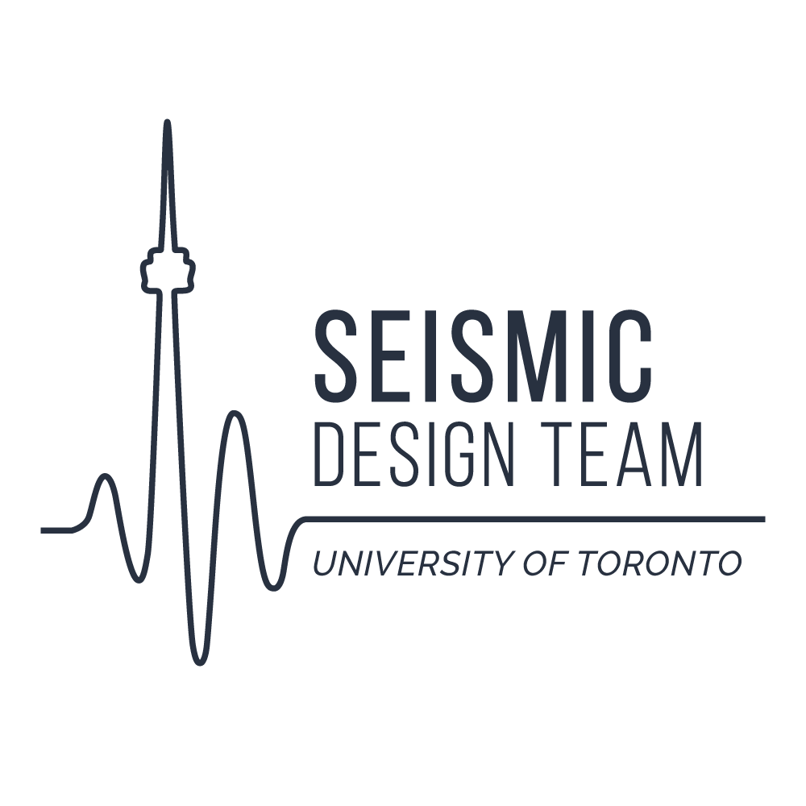
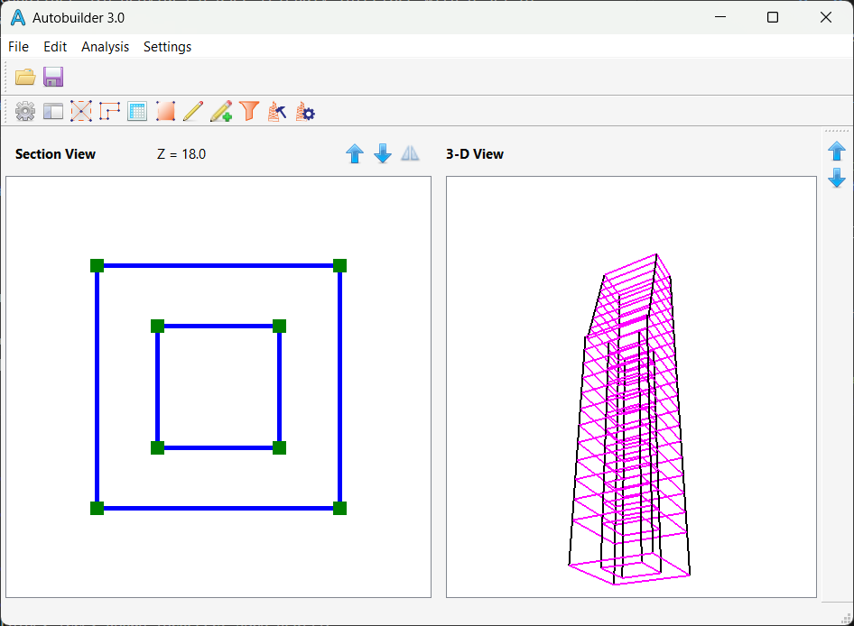

<div align="center">

  
  <h1>UofT Seismic Design Team Autobuilder 3.0</h1>
  
  <p>
    Seismic Design, Automation, and Optimization!
  </p>
</div>

<!-- Table of Contents -->
# :notebook_with_decorative_cover: Table of Contents

- [About the Project](#star2-about-the-project)
  * [Screenshots](#camera-screenshots)
  * [Framework](#space_invader-tech-stack)
  * [Features](#dart-features)
- [Getting Started](#toolbox-getting-started)
  * [Running Tests](#test_tube-running-tests)
  * [Run Locally](#running-run-locally)
  * [Build](#triangular_flag_on_post-build)
- [Documentation](#book-Documentation)
- [Contact](#handshake-contact)
- [Acknowledgements](#gem-acknowledgements)

<!-- About the Project -->
## :star2: About the Project

Autobuilder 3.0 provides a user-friendly interface with a set of features that allows structrual designers to parameterize and optimize high-rise structures subjected to dynamic loads.

<!-- User Interface -->
### :camera: Screenshots

<div align="center"> 
  
</div>

<!-- TechStack -->
### :space_invader: Framework

<details>
  <ul>
    <li><a href="https://www.qt.io/qt-for-python">PyQt5</a></li>
    <li><a href="https://wiki.csiamerica.com/display/kb/OAPI">SAP2000 OAPI</a></li>
  </ul>
</details>

<!-- Features -->
### :dart: Features

- Structural Components Parameterization
- Seismic Analysis
- Member Utilization Calculations
- Center of Rigidity Estimation

<!-- Getting Started -->
## 	:toolbox: Getting Started

<!-- Run Locally -->
### :running: Run Locally

Clone the project

```bash
  git clone https://github.com/UofT-Seismic-Design-Team/Autobuilder-3.0.git
```

Go to the project directory

```bash
  cd Autobuilder-3.0
```

Install dependencies

```bash
  pip install -r requirements.txt
```

Run the program

```bash
  python Execution.py
```

<!-- Build -->
### :triangular_flag_on_post: Build

To build this project run

```bash
  pyinstaller Execution.spec
```

<!-- Documentation -->

## :book: Documentation
Currenly, Autobuilder is only for internal use. Please reach out to the UofT Seismic Design Team: ut.seismic@gmail.com if you are seeking for more information and future collaboration opportunities.

<!-- Contact -->
## :handshake: Contact

Website: [https://seismic.skule.ca](https://seismic.skule.ca)

Email: [ut.seismic@gmail.com](mailto:ut.seismic@gmail.com)

<!-- Acknowledgments -->
## :gem: Acknowledgements

 - [Learn PyQt](https://www.learnpyqt.com/)
 - [Readme Template](https://github.com/othneildrew/Best-README-Template)
